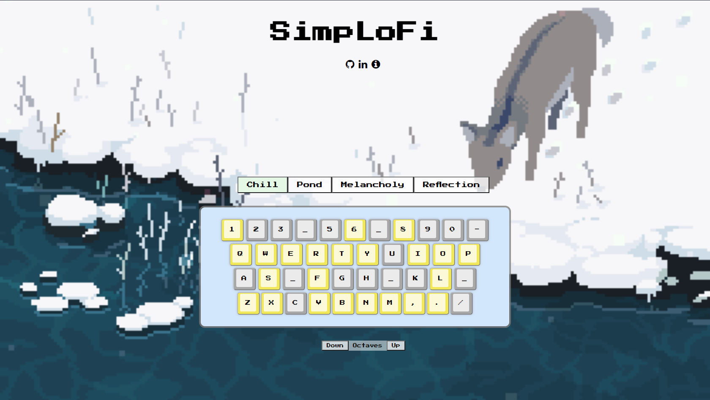

# [Live](https://davidoh14.github.io/SimpLoFi/)

# BACKGROUND:

Welcome to SimpLoFi, where anybody can create a mini lo-fi song. Select a chord progression (think of the left hand on a piano that sets you up for the melody). Now all that is left is to simply create a melody, with recommended notes based on the selected chord progression.


### FUNCTIONALITY
    
In SimpLoFi, users will be able to:
- Select one of the provided chord progressions to create the basis for the melody 
- Select one of the provided drum beats
- Create a melody by selecting notes within the recommended notes, which are based on selected chord progression.
- Control volumes for drums, chord progression, and melody independently
- Select ambient noises
- Select different instruments
- Change tempo
- Record and playback 


### MVPS

- One chord progression
- One drum track
- Keyboard visualization: Each key on the keyboard will represent a note, and each note that falls within the chord progressions will illuminate as recommendations


### WIREFRAME


TECHNOLOGIES, LIBRARIES, APIs:

- HTML
- CSS
- Javascript, DOM
- Tone.js
- Import instruments from Logic


## IMPLEMENTATION

The biggest challenge of the project was enabling access to all the different parts of a chord progression. There were three main forms of a chord to keep track of: the filename reference to the chord, the playing audio instance of the chord, and the main chord object that would be passed as arguments to functions. Each time a chord was played, a separate playing audio instance would be created. This meant that you could not simply pause it by referencing the original chord object, but would have to separate the playing audio instance as a global variable. Otherwise, the play/pause toggle would just be creating new playing audio instances that would play simultaneously every time you would try to pause or play. 

```js
let playingChord = {}; // returns 'chord.dataset.file' : [chord, chordAudio]
let playingChordKVP = Object.entries(playingChord)[0]; // returns ['chord.dataset.file', [li.chord.active, audio]]
let playingChordAudio = playingChordKVP[1][1]; 

let isPlaying = false;

function playToggle(chord){
    
    const existingChord = Object.keys(playingChord) // returns chord.dataset.file as Mystery
    const newChord = chord.dataset.file // returns chord.dataset.file as Mystery
    
    if (existingChord[0] === newChord) {
        pauseChord(chord)
    } else if (existingChord.length && (existingChord[0] !== newChord)) {
        pauseChord(playingChordKVP);
        playChord(chord);
    } else {
        playChord(chord);
    }
}

function playChord(chord){
        const chordURL = "samples/LANDR/" + chord.dataset.file + ".wav"
        const chordAudio = new Audio(chordURL);
        chordAudio.volume = 0.5;
        recommended(chord);
        
        chordAudio.currentTime = 0;
        chordAudio.play();
        
        chordAudio.loop = true;
        chord.classList.add('active');
        playingChord[chord.dataset.file] = [chord, chordAudio];
}

function pauseChord(chord){
    let playingChordKVP = Object.entries(playingChord)[0]; // returns ['chord.dataset.file', [li.chord.active, audio]]
    let playingChordAudio = playingChordKVP[1][1];

    playingChordAudio.pause();
    playingChordAudio.currentTime = 0;
    chords.forEach(chord => {
        chord.classList.remove('active');
    });
    
    unrecommend();
    playingChord = {};
}
```
